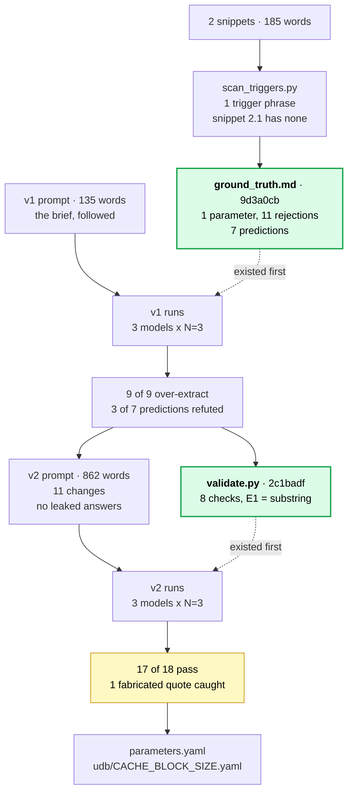

# Extracting architectural parameters from RISC-V specifications

LFX Mentorship Fall 2026 coding challenge. RISC-V International,
[`riscv/riscv-unified-db`](https://github.com/riscv/riscv-unified-db).

Rajveer Bishnoi, [@RAJVEER42](https://github.com/RAJVEER42)

**Input:** 2 snippets of the Privileged spec, 185 words.
**Output:** 1 parameter, 11 rejected candidates.
**Runs:** 3 models from 2 labs, 36 usable runs, 2 prompt versions.

---

## The five things worth your time

**1. Snippet 2.1 is a precision test, and the right answer is zero.**
It contains none of the challenge's trigger words. Counted, not read:
`scripts/scan_triggers.py` finds exactly **one** trigger phrase across both
snippets. Anything extracted from 2.1 is a false positive.

**2. All 3 models failed the same way, in 9 of 9 runs.**
Every model called cache capacity a parameter. It is implementation-specific, so
it passes a trigger scan, but no instruction's behaviour depends on it. UDB has no
cache-capacity parameter among its 227 files, so the maintainers already drew this
line. A failure reproducing across 3 models from 2 labs is a property of the
prompt, not the model.

**3. A program caught a fabricated quotation I would have accepted.**
One model wrote `excerpt: "The ... size of a cache block are both
implementation-specific"`, eliding 11 words behind an ellipsis and presenting it as
verbatim. One substring test found it. That is the answer to "how did you deal with
hallucinations": not by instructing the model, by making claims checkable.

**4. The models found a hole in my own rule.**
Two of them defended cache capacity with "software can discover it through the
execution environment", at high confidence, in 6 of 6 chances. That quotes a real
sentence of the passage and passes every mechanical check. It is wrong because the
execution environment sits outside the ISA, and my prompt never said so. I have not
patched it, because writing v3 while reporting v2 turns a measurement into a fitted
result.

**5. Two defects in `riscv-unified-db`, found by reading the schema.**
`schema_defs.json` has `4095` where `4096` belongs in both power-of-two enums,
while `z3.rb` implements the same rule correctly. And 163 of 227 parameter files
still say `long_name: TODO`.

## The three requested deliverables

| Asked for | Where |
|---|---|
| **1.** LLM details: name, version, context length | [§1](#1-models) |
| **2.** Prompts, how refined, hallucination handling | [§3](#3-prompt-development), [§4](#4-hallucinations) |
| **3.** Results as YAML: name, description, type, constraints | [`parameters.yaml`](parameters.yaml), plus [`udb/CACHE_BLOCK_SIZE.yaml`](udb/CACHE_BLOCK_SIZE.yaml) in UDB's shape |

## Check it without trusting me

```bash
./run.sh                 # no credentials, no spend, seconds
./run.sh --udb <path>    # also checks the UDB claims
```

That re-derives **all 51 numbers in this file** from the raw output in `results/`
and fails if any disagree. It also re-runs the validator over committed output and
confirms every quotation in `parameters.yaml` is a real substring of its source.

### What was done, and in what order

The order is the evidence. Two commits had to land before the work they judge, and
both are checkable from git timestamps.

Solid arrows are data flow. Dotted arrows are **commit order only**: the green boxes
never fed into the runs, they simply existed first, which is the whole point. Both
prompts take the snippets as input; that edge is left out to keep the shape legible.



**Gate 1.** `ground_truth.md` was committed before anything in `results/` existed. So
the adjudication and the 7 predictions could not have been shaped by model output.
The models were measured, not believed.

**Gate 2.** `validate.py` was committed before any v2 output existed. So its checks
could not have been tuned to flatter the results they went on to judge.

---

## 1. Models

| | DeepSeek-V4-Pro | Gemini 3.6 Flash | Gemini 2.5 Flash |
|---|---|---|---|
| Model ID | `deepseek-ai/DeepSeek-V4-Pro` | `gemini-3.6-flash` | `gemini-2.5-flash` |
| Input context | 1,048,576 | 1,048,576 | 1,048,576 |
| Weights | open, MIT | proprietary | proprietary |
| Via | HF Inference Providers | AI Studio free tier | AI Studio free tier |

Context lengths come from each model's `config.json` or API metadata, not from
memory. DeepSeek reaches 1,048,576 by YaRN scaling (`factor: 16`) from a native
65,536, worth stating precisely because quality at full extension is not
guaranteed. All three are reasoning models, which matters for §4.

`temperature=0`, `max_tokens` recorded per run, **N=3** per model per snippet per
version, `finish_reason` asserted. **No parameter-name list supplied**, unlike
Part I (§5).

**Two models are missing on purpose.** `gemini-2.5-pro` is not on the free tier;
all 6 calls returned `429`, and those failures are committed rather than deleted.
**Claude Opus 5 is excluded** because the session that produced this work had
already read `ground_truth.md`, so its output would not be an independent
extraction. A real limitation, not a footnote.

Completion tokens: DeepSeek 6,255 for v1 and 17,618 for v2; both Gemini models
stayed inside the free tier. v2 costs 4.1x the prompt tokens of v1, free at 185
words and dominant at 52,000 spec lines.

## 2. Results

**`CACHE_BLOCK_SIZE`**, integer, a power of two, uniform across the system.

The uniformity is scoped: the spec says "in the initial set of CMO extensions",
reserving the right to relax it, so it must not become a permanent invariant. No
numeric bound is given because the passage gives none.

Two shapes, because they differ in substance. [`parameters.yaml`](parameters.yaml)
uses the challenge's four fields plus verbatim provenance, an ISA-visibility
justification, and the rejections. [`udb/CACHE_BLOCK_SIZE.yaml`](udb/CACHE_BLOCK_SIZE.yaml)
uses UDB's shape, where `type` and `constraints` are **not** top-level fields but
live inside `schema:` as JSON Schema. Validated against the real
`param_schema.json` with `$refs` resolved.

**The 11 rejections carry most of the information.** Three matter most:

| Rejected | Reason | Why |
|---|---|---|
| Cache capacity, cache organization | `NOT_ISA_VISIBLE` | Implementation-specific, so passes a trigger test, but not observable through the ISA. UDB has no parameter for either |
| Uniformity of block size | `CONSTRAINT_NOT_PARAMETER` | "Shall" is a mandate. It constrains the parameter instead of being one |
| Which CSRs are implemented | `NOT_STATED_IN_TEXT` | Genuinely implementation-dependent, but the passage never says it. Extracting it means answering from RISC-V knowledge, not the input |

That last one was recorded in `ground_truth.md` before any run, and DeepSeek
independently rejected it with the same code in 3 of 3 runs.

## 3. Prompt development

Full detail in [`analysis/v1_failures.md`](analysis/v1_failures.md) and
[`analysis/v2_delta.md`](analysis/v2_delta.md).

**v1** ([`prompts/v1/`](prompts/v1/), 135 words) is the brief followed competently:
the trigger list verbatim, the four fields, enough structure to parse. Deliberately
no better. Crippling v1 to claim a big improvement would be easy and worthless, and
the refinement story is what this deliverable assesses. Its nine omissions are
listed in `prompts/v1/README.md`, written before the run.

**v1 failed** in 9 of 9 runs on 19.3.1, precision 1 in 3, with gold-set recall 9 of
9. Finding the real parameter was never the hard part. Three of seven predictions
were wrong, and the refutations were the useful part. All 3 models returned
`parameters: []` for snippet 2.1, 0 of 9, which refutes the common claim that LLMs
are strongly biased toward producing output. One prediction was untestable by
construction, which was my design error.

**v2** ([`prompts/v2/`](prompts/v2/), 862 words) makes 11 changes, each traceable to
a v1 failure: a three-part test applied in order, a required `isa_visible` field so
the test must be shown, a mandatory verbatim `excerpt` declared as mechanically
checked, structured `constraints`, a ban on signal words as constraint values, a
`rejected` list with reason codes, and "shall" excluded from signal words.

**The obvious fix would have been cheating.** The natural move is a negative example
saying cache capacity is not a parameter. But 19.3.1 is an evaluation input, so
putting its answer in the prompt measures recitation. It is also the error Part I
made by injecting the 185 gold names (§5), and having pointed that out, repeating it
would be indefensible. So v2 states the rule as a principle with off-snippet
examples only, and a mechanical check confirms no snippet-specific term appears in
the v2 prompts.

Deliberately **not** added: permission to return an empty list. All three models
already did so unprompted.

| | v1 | v2 |
|---|---|---|
| Over-extraction on 19.3.1 | 9 of 9 | **6 of 9** |
| Gold-set recall | 9 of 9 | 9 of 9 |
| Snippet 2.1 correctly empty | 9 of 9 | 9 of 9 |
| Markdown fences | 15 of 18 | **6 of 18** |
| `constraints` category errors | several | **none** |
| `rejected` populated on 2.1 | n/a | **9 of 9** |

**The whole precision gain comes from one model.** Gemini 3.6 Flash went 3 of 3 to
0 of 3; the other two did not move. So "v2 is better than v1" is **not** established
as a claim about the prompt. It is confounded with model identity. What is
established is that v2 exposed reasoning v1 hid: on 2.1, v1 gave a bare
`parameters: []`, while v2 gave the same verdict with four reason-coded rejections.

## 4. Hallucinations

Five modes, needing different treatments, and one that checking cannot fix.

| Mode | Seen | Caught by |
|---|---|---|
| Fabricated quotation | `"The ... size of a cache block"` | substring check, E1 |
| Ungrounded but true | "in bytes", absent from the passage | validator, E4 |
| Category error | `constraints: Implementation-specific.` | validator, E2 |
| Truncation as a false empty | empty content read as "no parameters" | `finish_reason` guard |
| **Faithful reasoning from a bad rule** | the execution-environment argument | **nothing mechanical** |

**Why the fabricated quote matters.** A reviewer would accept it: the quote is
semantically faithful and an ellipsis reads as careful. It defeats provenance,
because an elided quote cannot be found by searching the source. And it was
inconsistent inside one response, which quoted that same sentence correctly and in
full for two other parameters. That is worse than a capability limit, because it
passes any single-run spot check.

**Truncation is the subtle one.** A reasoning model that exhausts its budget returns
empty content, which parses as "found no parameters". For snippet 2.1 that is the
correct answer, so truncation imitates the behaviour being measured and would
inflate the score through a bug. The runner treats any `finish_reason` other than
`stop` as a run failure. It caught 6 cases on first use, from a quota error it was
not designed for.

**The mode checking cannot fix** is item 4 above. Two models justified cache
capacity with a real sentence of the passage, and every mechanical check passed.
Gemini 3.6 Flash rejected the same candidate in 3 of 3 runs from the identical
prompt: one underspecified rule, three models, two opposite readings. Structural
checks catch fabrication but not faithful reasoning from a bad rule. Requiring the
model to state its justification did not prevent that error, it explained it, which
is worth more.

## 5. Reading Part I honestly

On [issue #2053](https://github.com/riscv/riscv-unified-db/issues/2053),
`titoatwork` published measurements of the public Part I snapshot and then corrected
himself. I re-verified the load-bearing claim from source rather than inherit it,
fetching both files from PR #1791's head:

```
injected list size : 185
gold set size      : 185
identical sets     : True
```

`extract.py:211` injects that list into every prompt, unconditionally, with "when a
parameter you find matches one of these known names, use the exact name".

**So Part I's 69.7% is grounding recall, not discovery recall.** WARL recall of 12
of 24 happens with all 24 names already in the prompt, so that failure is
identification rather than vocabulary, which explains why adding WARL guidance made
results worse. **Our runs supply no name list, so our numbers are not comparable to
Part I's.**

Attribution, because it is easy to get wrong: the WARL evaluation, the ablation and
the legal-value-set refinement are `titoatwork`'s. `hjaat` opened the issue and
raised the WARL problem, crediting a Slack exchange with Allen Baum.
`ishaan-arora-1` notes the current pipeline is internal, so PRs #1765 to #1832 are
background rather than current state.

That refinement and our cache-capacity finding are one rule reached from two
directions:

> A signal of implementation freedom is necessary but not sufficient. A parameter
> exists only where the implementation genuinely chooses, and that choice is
> ISA-visible.

Cache capacity fails on visibility. A WARL field with an architecturally fixed legal
set fails on choice.

## 6. Two findings in riscv-unified-db

Detail and evidence in
[`reference/udb-schema-notes.md`](reference/udb-schema-notes.md), verified at commit
`bd775a94`. Neither has been filed as a PR, because both need a maintainer's view
first.

**Two implementations of "power of two" that disagree.** A cache block is a NAPOT
range, so `CACHE_BLOCK_SIZE` is always a power of two, but upstream's schema is
`minimum: 1, maximum: 2^64-1`. `schema_defs.json` already defines
`64bit_unsigned_pow2` and `$ref`-ing it is precedented, but its enum has `4095`
where `4096` belongs, at lines 866 and 876, in both enums. `z3.rb` implements the
same rule with `x & (x-1)` and disagrees on exactly those two values. 4096 is the
most common cache block and page size in the architecture. **So the fix for the
missing constraint is blocked by the defect**, which is the part worth knowing. It
survives because the enum has no live data consumer. I am **not** claiming it breaks
anything today; that needs the value-validation path traced.

**`long_name: TODO` in 163 of 227 files**, 71.8%, including `CACHE_BLOCK_SIZE`. The
unmet need is not finding parameters, since the maintainers found 227, but filling
prose fields at scale. Usage is inconsistent upstream, so this is a question for the
SIG rather than an assumption.

## 7. How this maps to the Part II proposal

| Item | What is here |
|---|---|
| **1.** Continue finding parameters with LLMs | The extraction, plus what makes it measurable: ground truth committed first, a negative control, no name list |
| **2.** Extend the classification scheme | A second axis in `parameters.yaml`. Reason codes say why something is not a parameter; `udb_absence` says why UDB lacks it, as `real_gap`, `udb_derives`, or `out_of_scope`, all checkable against the repo. `IALIGN` is the `udb_derives` case, verified at `globals.isa:797` |
| **3.** Agents and skills for reproducible runs | [`.claude/skills/param-extract/`](.claude/skills/param-extract/), plus `run.sh` and four scripts. [`HANDOVER.md`](HANDOVER.md) packages the instrument for someone else to run at corpus scale |
| **4.** Export in UDB YAML format | [`udb/CACHE_BLOCK_SIZE.yaml`](udb/CACHE_BLOCK_SIZE.yaml), schema-validated |
| **5.** Open a PR for reviewed parameter files | The two §6 findings are PR-ready, held for SIG discussion first |

## 8. Limitations

* **2 snippets, 1 gold parameter, 36 usable runs.** Every figure is a count, not a
  rate. Nothing generalises to the full spec, and no Jaccard coefficient is
  reported because at this n it would be meaningless.
* "Precision 1 in 3 to 1 in 1" describes 3 runs of 1 model.
* **v2's gain is confounded with model identity**, since only 1 of 3 improved.
* **Tier-confounded:** DeepSeek-V4-Pro is Pro-tier, both Gemini models Flash-tier,
  because Gemini Pro is not free. This is not a model ranking.
* **Claude Opus 5 absent**, for the reason in §1.
* **The gold set is mine.** DeepSeek's independent rejection of the
  `NOT_STATED_IN_TEXT` trap corroborates one judgement; the rest rests on my
  reading. Three falsification conditions were set in advance and none were met.
* **v3 is specified but unrun**, by choice.
* 227 parameter files at `bd775a94` versus `titoatwork`'s 223 real parameters. The
  4-file difference is unresolved.

## 9. Repository

| Path | Contents |
|---|---|
| `parameters.yaml`, `udb/` | The results, both shapes |
| `ground_truth.md` | Adjudication and 7 predictions, committed before any run |
| `prompts/v1/`, `prompts/v2/` | Both prompts, each with design notes |
| `results/` | All 42 run records, raw and unedited, including 6 failures |
| `analysis/` | v1 failure modes, and the v1 to v2 delta |
| `scripts/` | Trigger scan, runner, validator, UDB schema check, claim audit |
| `.claude/skills/param-extract/` | Reusable skill |
| `HANDOVER.md` | The instrument, packaged for reuse at corpus scale |
| `reference/` | Verified notes on the UDB schema, the models, and prior art |
